# 邮箱绑定操作指南

## 📌 目录
1. [**绑定 Gmail 邮箱**](#cpAii)
2. [**绑定 Outlook 邮箱**](#YsOcg)
3. [**绑定 QQ 邮箱**](#fN33Y)
4. [**绑定 163 邮箱**](#pBQrF)
5. [**绑定 iCloud 邮箱**](#yX2Sh)

# 一、绑定 Gmail 邮箱 
### 1.1 准备工作
+ 一个可用的 Gmail 账号（需能正常登录）
+ 开启「两步验证」，并生成「应用专用密码」（App Password）
+ 记录下该应用专用密码，后续绑定时会用到

### 1.2 操作步骤
**第一步：** 登录[谷歌账号](https://accounts.google.com) ，进入「Google账号」→「安全性与登录」→「两步验证」，确认已开启两步验证。  
<!-- 这是一张图片，ocr 内容为： -->
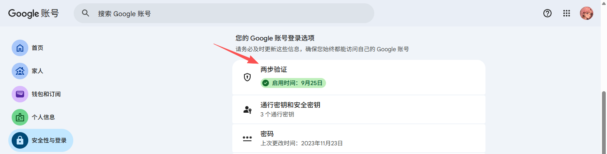

**第二步：** 搜索「应用专用密码」，进入并生成一个专用密码，复制保存。  
<!-- 这是一张图片，ocr 内容为： -->
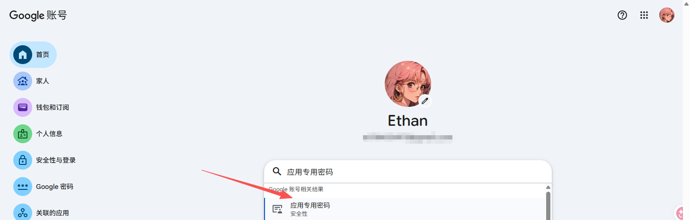<!-- 这是一张图片，ocr 内容为： -->
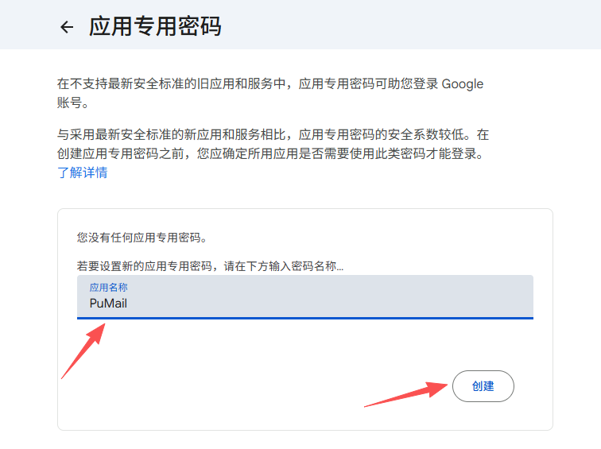<!-- 这是一张图片，ocr 内容为： -->
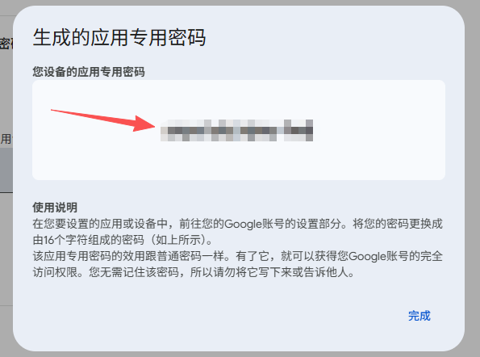

**第三步：** 在PuMail客户端中添加邮箱账号，服务商选择「Gmail」，填入邮箱地址和应用专用密码，按提示完成授权绑定，即可添加成功。

<!-- 这是一张图片，ocr 内容为： -->
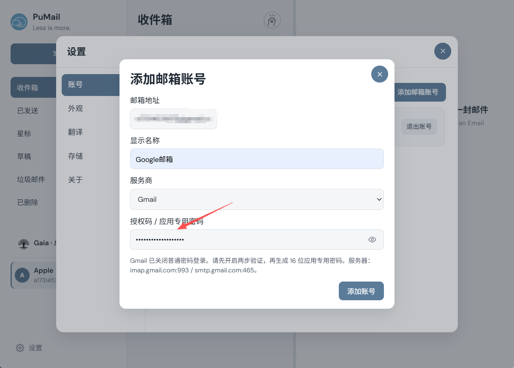

### 1.3 常见问题
+ 提示「密码错误」：确认使用的是应用专用密码，而不是 Gmail 登录密码。
+ 无法开启两步验证：需先绑定手机号并完成验证，再开启两步验证。

# 二、绑定 Outlook 邮箱 
### 2.1 准备工作
+ 一个可用的 Outlook  账号
+ 确认账号已开启 IMAP 访问权限
+ 准备账号密码（或应用密码，若已开启两步验证）

### 2.2 操作步骤
**第一步：** 登录 [Outlook 网页版](https://outlook.office.com/mail/inbox)，进入「设置」→「邮件」→「转发语IMAP」，确认 IMAP 服务已开启。

<!-- 这是一张图片，ocr 内容为： -->
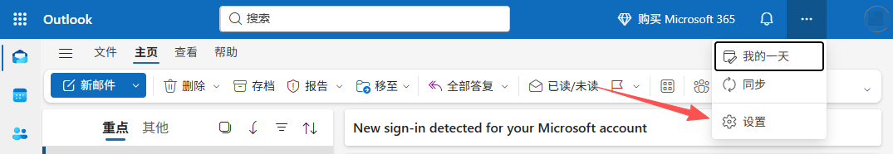

<!-- 这是一张图片，ocr 内容为： -->
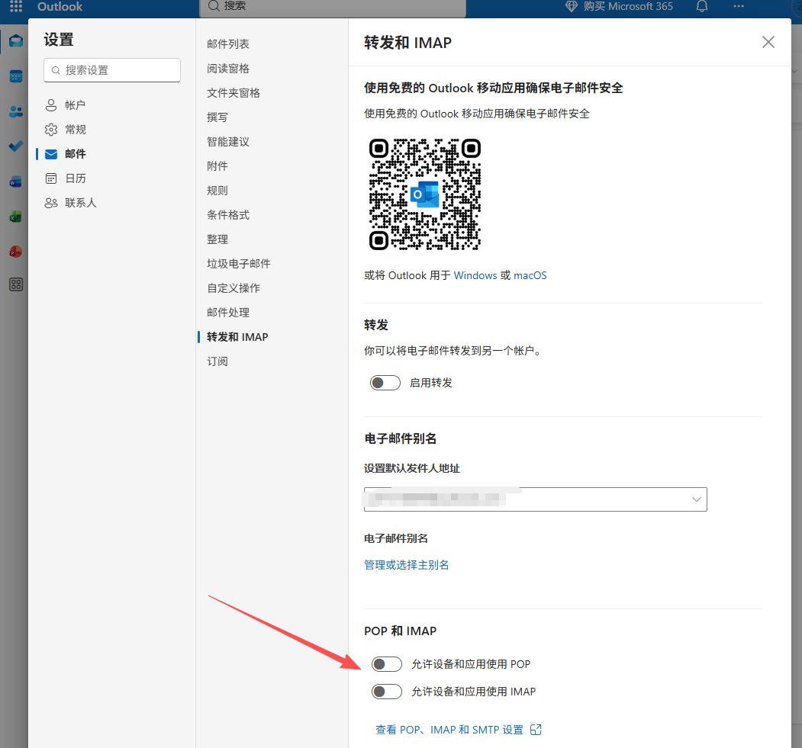

**第二步：** 在邮件客户端新建账号，选择「Outlook 」，输入完整邮箱地址。

<!-- 这是一张图片，ocr 内容为： -->
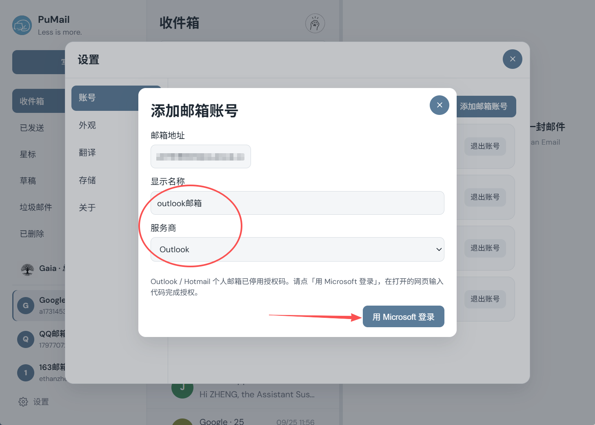

**第三步：** 输入代码以允许访问，代码在原Pumail邮箱登录界面处复制，允许访问并接受即可完成绑定。

<!-- 这是一张图片，ocr 内容为： -->
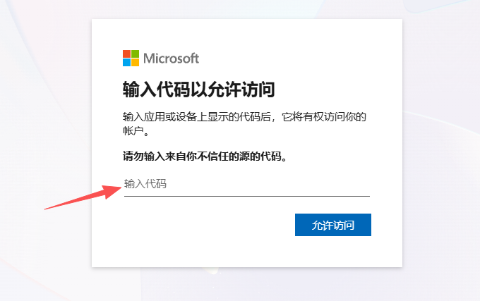<!-- 这是一张图片，ocr 内容为： -->
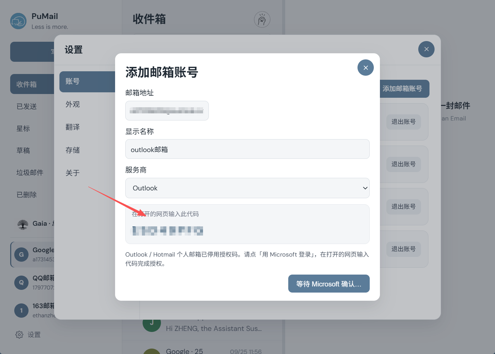

<!-- 这是一张图片，ocr 内容为： -->
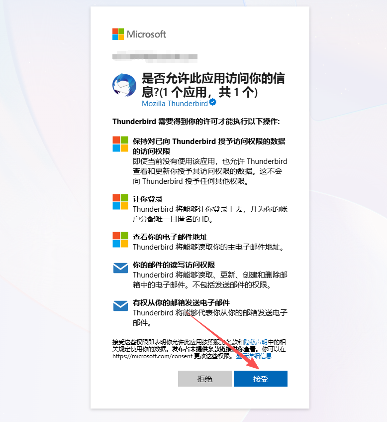

<!-- 这是一张图片，ocr 内容为： -->
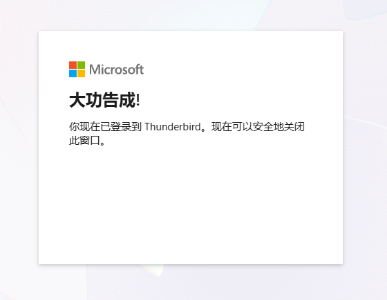

### 2.3 常见问题
+ 提示「无法连接服务器」：检查 IMAP 是否已开启，或改用 Exchange 方式绑定。
+ 频繁要求重新登录：确认账号未开启额外安全验证，或改用应用密码。

# 三、绑定 QQ 邮箱 
### 3.1 准备工作
+ 一个可用的 QQ 邮箱账号
+ 开启 QQ 邮箱的 SMTP / IMAP 服务
+ 获取「授权码」（用于第三方客户端登录）

### 3.2 操作步骤
**第一步：** 登录[ QQ 邮箱网页版](https://mail.qq.com/)，进入「设置」→「账号与安全」，找到并开启「POP3/IMAP/SMTP/Exchange/CardDAV/CalDAV 服务」

<!-- 这是一张图片，ocr 内容为： -->
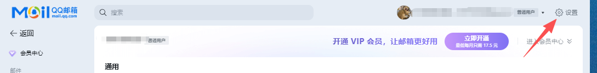

<!-- 这是一张图片，ocr 内容为： -->
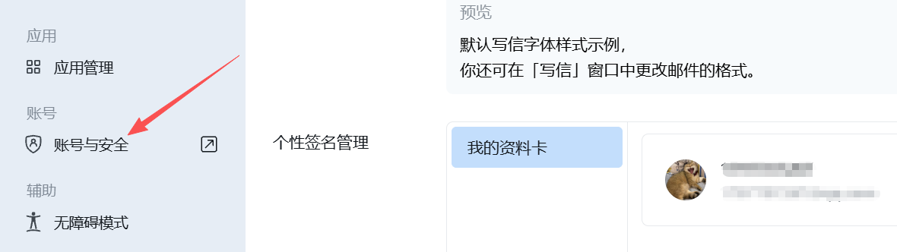

<!-- 这是一张图片，ocr 内容为： -->
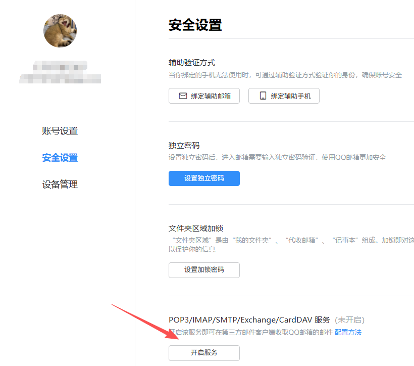

**第二步：** 开启 IMAP/SMTP 服务，按提示用手机发送短信验证，获取 16 位「授权码」并复制保存。

<!-- 这是一张图片，ocr 内容为： -->
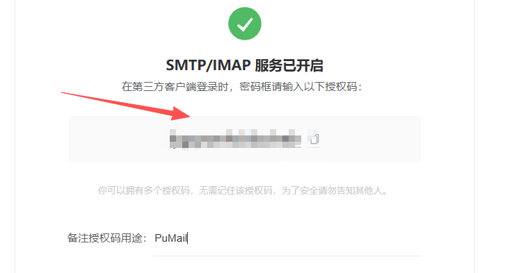

**第三步：** 在邮件客户端新建账号，填入 QQ 邮箱地址，密码处填写刚刚复制的「授权码」，完成绑定。

<!-- 这是一张图片，ocr 内容为： -->
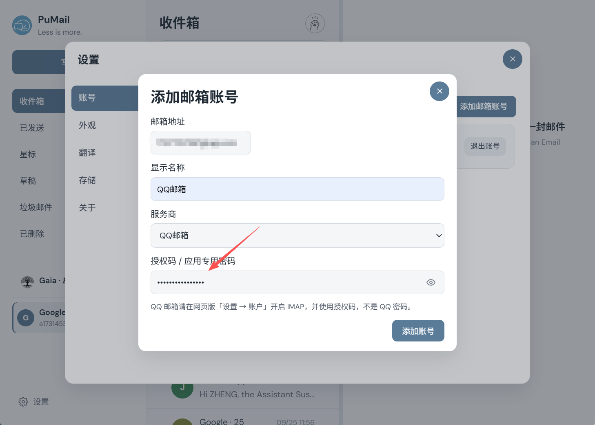

### 3.3 常见问题
+ 提示「授权失败」：确认密码处填的是授权码，而不是 QQ 邮箱登录密码。
+ 授权码丢失：可重新进入设置关闭再开启服务，重新生成授权码。

# 四、绑定 163 邮箱 
### 4.1 准备工作
+ 一个可用的 163 邮箱账号
+ 开启 163 邮箱的 IMAP / SMTP 服务
+ 获取「客户端授权密码」

### 4.2 操作步骤
**第一步：** 登录[ 163 邮箱网页版](https://email.163.com/)，进入「设置」→「POP3/SMTP/IMAP」，点击开启 IMAP/SMTP 服务。

<!-- 这是一张图片，ocr 内容为： -->
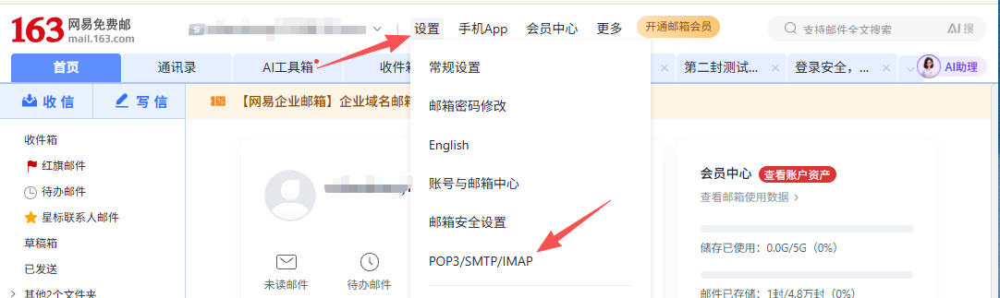

<!-- 这是一张图片，ocr 内容为： -->
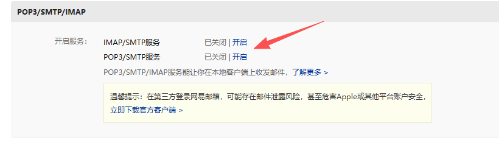

**第二步：** 按提示用手机扫码或短信验证，设置「客户端授权密码」并复制保存。

<!-- 这是一张图片，ocr 内容为： -->
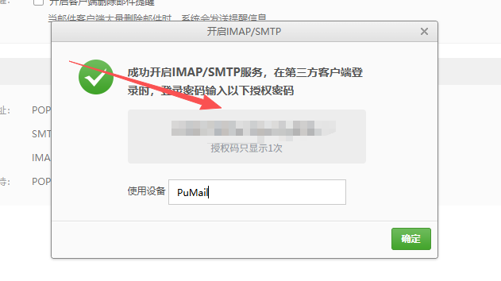

**第三步：** 在邮件客户端新建账号，填入 163 邮箱地址，密码处填写「客户端授权密码」，完成绑定。

<!-- 这是一张图片，ocr 内容为： -->
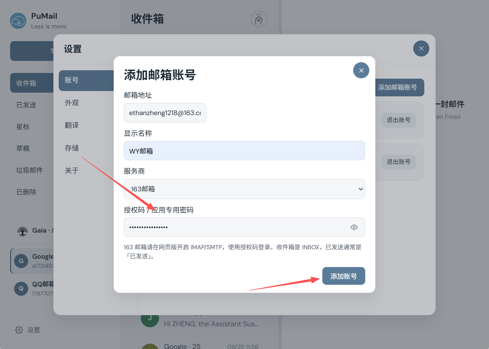

### 4.3 常见问题
+ 提示「服务器拒绝连接」：确认已开启 IMAP/SMTP 服务，并核对服务器地址与端口。
+ 忘记授权密码：重新进入设置关闭再开启服务，重置客户端授权密码。

# 五、绑定 iCloud 邮箱 
### 5.1 准备工作
+ 一个可用的 Apple ID（需已开启「双重认证」）
+ 在 iCloud 网页版或 Apple 账户设置中开启「iCloud 邮件」
+ 生成「App 专用密码」（用于第三方客户端登录）

### 5.2 操作步骤
第一步：登录 [iCloud 网页版](https://www.icloud.com)，确认打开苹果「双重认证」.  
<!-- 这是一张图片，ocr 内容为： -->
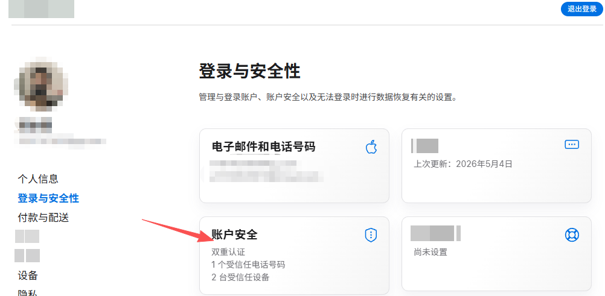

**第二步：** 在 Apple 账户页面（appleid.apple.com）的「登录与安全」中，为邮件客户端生成一个「App 专用密码」并复制保存。

<!-- 这是一张图片，ocr 内容为： -->
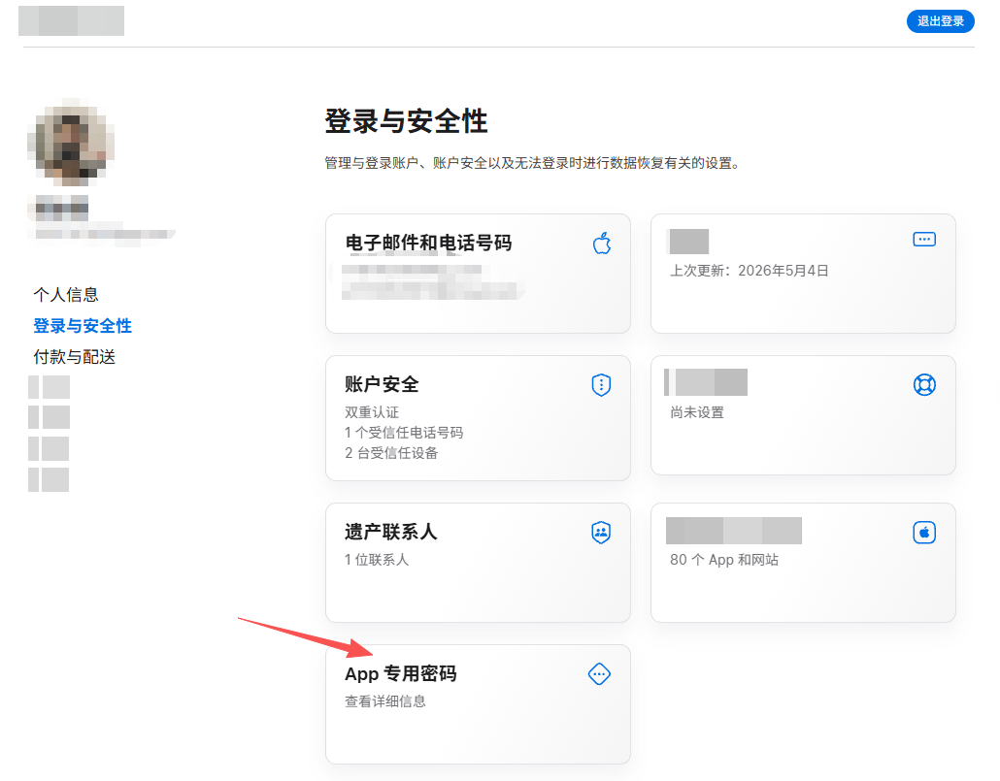

<!-- 这是一张图片，ocr 内容为： -->
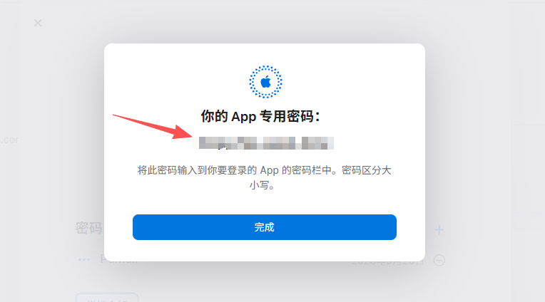

**第三步：** 在邮件客户端添加账号，选择「iCloud」，填入邮箱地址，密码处填写「App 专用密码」，完成绑定。

<!-- 这是一张图片，ocr 内容为： -->
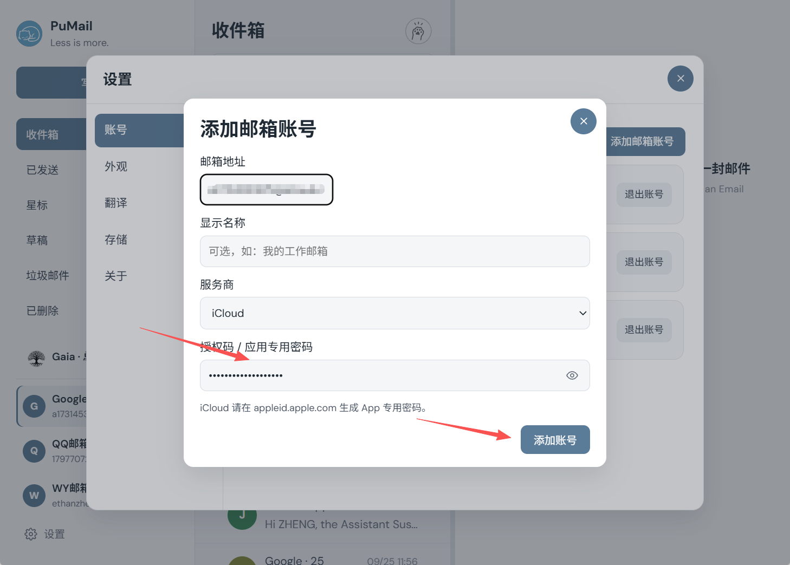

### 5.3 常见问题
+ 提示「密码错误」：确认密码处填的是「App 专用密码」，而不是 Apple ID 登录密码。
+ 无法生成 App 专用密码：需先开启 Apple ID 的「双重认证」，再重新生成。

# 📝 恭喜你走到了这一步！！！
## 完成以上 5 个邮箱绑定后，你就可以在PuMail客户端里统一管理 Gmail、Outlook、QQ、163 和 iCloud 邮箱的所有邮件了。
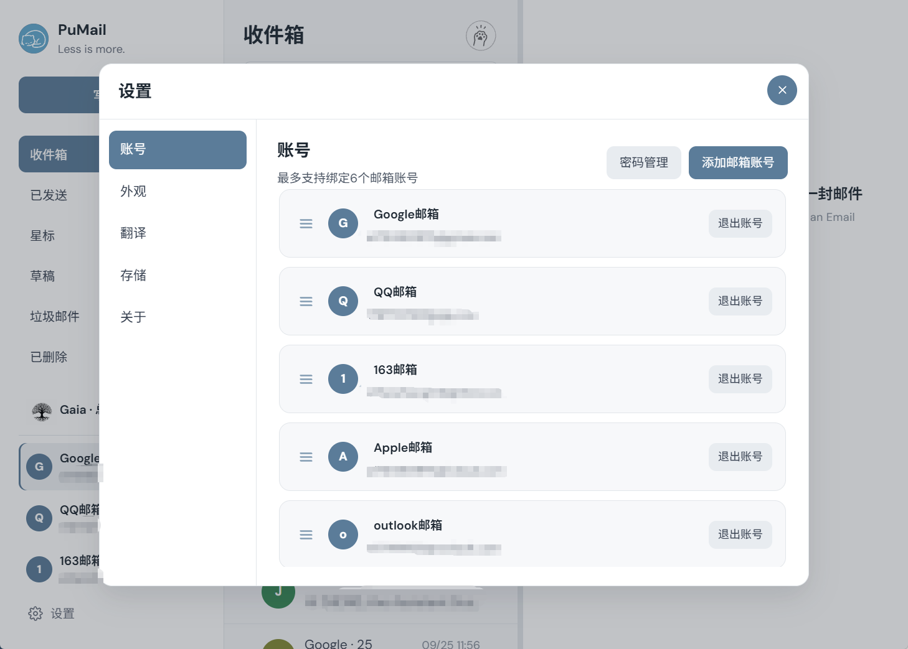

